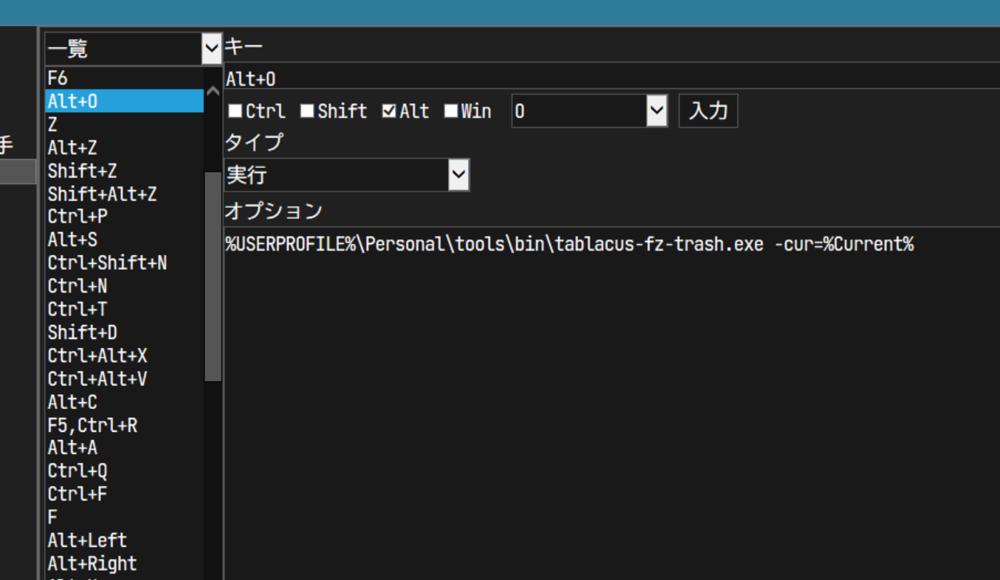

# README

Command line tool for [Tablacus Explorer](https://tablacus.github.io/explorer.html).

- List up items on current directory (specified with `-cur`) and select with fuzzy-finder.
- Selected items are move to trash directory
    - Directory name is specified with `-trashname`.
    - Default is `_obsolete`.

